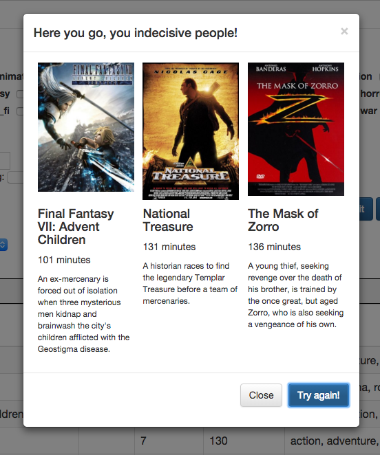

# movie-picker

Simple Angular application that imports, formats, and filters a .csv IMDb user database export. Allows a user to select specific criteria to filter by and pick a random selection as watching options.

**Imagine the following:**

*You have just finished a long day and a good meal, and now its time to relax. You/you and your significant other decide to watch a movie--one of the many you have collected over the years. You open up the cabinet, peruse the bookshelf, or otherwise look through the significant stack of movies you own, occasionally pulling one out as an option, keeping in mind any time limitations or genre preferences. You then go back through the options you have selected, and pick the one you are most interested in. If you have a significant other, the previous steps are repeated for their choices as well, with each of you nixing the options you don't want to see as much along the way. After running through this entire process for a half an hour, you are *finally* ready to relax!*

If this scenario sounds familiar, then you may be able to benefit from this little application as much as I have. :)

###Demo: <http://skye2k2.github.io/movie-picker/>
Note: Demo is not able to load movie posters because the API blocks requests from the Github domain--they should load just fine, locally.

How to use:
------
1. Download this repository onto a webserver (locally, WAMP or MAMP work well)
1. Create a free IMDb account
1. Create a new list of titles (http://www.imdb.com/list/create)
1. Add your movies to your new list (search for movie, click down arrow next to "+ Watchlist", and click the list to add to)
1. Export your list, and put into the /lists directory (open list, scroll to bottom, and click "Export this list")
1. Add the filename of your list to the ```$scope.movieLists``` array
1. Run the app by opening in a browser (ex. http://localhost:8888/movie-picker/)

NOTE: You *could* just download the repo and open index.html in a browser, but you would need to change the URL paths to have them resolve properly



Features:
------
- "Help me choose" randomly picks a number of filtered results as watching options for you
- Uses OMDb API to fetch movie posters and descriptions in "Help me choose" mode
- Utilizes cdnjs.cloudflare.com CDN
- Falls back to local assets when offline
- Genre inclusion and exclusion
- Filter feature films or TV series
- Limit by user or IMDb rating
- Switch between multiple lists
- Quick live keyword filtering
- Selecting a genre filter automatically deselects its cooresponding anti-filter, and vice versa
- When switching lists with active filters, apply filters after loading
- Restart "Help me choose" if a user removes all results
- Ascending/descending sort-ability


ChangeLog:
------
####v1.0.0


Technologies:
------
- IMDb
- OMDb API
- Angular
- jQuery
- jQuery.csv
- Bootstrap

TODO:
------
- URL parameters for preset searches
- Large list performance (bindonce)
- Load a file by default from URL parameter
- Single list isolation mode
